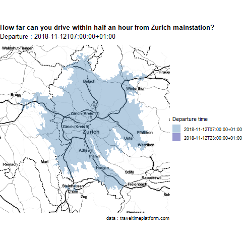

The traveltimeR-package allows to retrieve isochrones for traveltimemaps from the Traveltime Platform API directly from R. The isochrones are stored as sf-objects, ready for visualization or further processing. The isochrones display how far you can travel from a certain location within a given timeframe. Numerous modes of transport are supported.

https://api.traveltimeapp.com/

__GET an API-KEY__ here: http://docs.traveltimeplatform.com/overview/getting-keys/

For non-commercial use the usage of the API is free up to 10'000 queries a month (max 30 queries per min). For commercial use (e.g. to integrate the API into a website) a license is needed. 


```{r, message=F, warning=F}
devtools::install_github("tlorusso/traveltimeR")

# load packages
if (!require("pacman")) install.packages("pacman")
pacman::p_load(dplyr, purrr, sf, mapview, traveltimeR)

```

You can easily retrieve the isochrones with the get_traveltime function. Find a list of supported countries here: http://docs.traveltimeplatform.com/overview/supported-countries/

# Querying the Traveltime-API with get_traveltime
```{r, echo=TRUE, eval=FALSE}
# retrieve data via request 

# The following transport modes are supported:

# "cycling"", "cycling_ferry", "driving", "driving+train", "driving_ferry", "public_transport", 
# "walking", "walking+coach", "walking_bus", "walking_ferry" or "walking_train".

# how far can you go by public transport within 30 minutes?
traveltime30 <- get_traveltime(appId="YourAppId",
               apiKey="YourAPIKey",
               location=c(47.378610,8.54000),
               traveltime=1800,
               type="public_transport",
               departure="2018-10-05T08:00:00Z")

# ... and within 60 minutes?
traveltime60 <- get_traveltime(appId="YourAppId",
               apiKey="YourAPIKey",
               location=c(47.378610,8.54000),
               traveltime=3600,
               type="public_transport",
               departure="2018-10-05T08:00:00Z")

```

```{r, echo=FALSE, eval=TRUE}
traveltime30 <- readRDS("traveltime30.RDS")
traveltime60 <- readRDS("traveltime60.RDS")
traveltimes <- readRDS("traveltimes.RDS")
```

# Taking a glimpse at the isochrones (mapview)

How far you can travel from Zurich Mainstation by public transport within 30 minutes or within an hour? The retrieved isochrones can be visualized with `mapview` to take a first glimpse. 

```{r,message=F, warning=F}

# mapview(traveltime, zcol="traveltime",burst = TRUE)


m1 = mapview(traveltime60,  col.regions = c("grey"))
m1 + traveltime30


```


# Plotting a Traveltime-Map (ggmap & ggplot2)

With the latest version of ggplot2, `geom_sf` has been introduced, which allows to plot geodata stored in dataframes with class sf very conveniently. Let's retrieve isochrones for three different traveltimes and plot them on top of a map.

```{r, warning=F, message=F, eval=FALSE}

# with purrr::map we can easily retrieve isochornes for different timespans


traveltimes <-c("walking","cycling","driving","public_transport") %>%
  map(.,~get_traveltime(appId="YourAppId",
                        apiKey="YourApiKey",
                        location=c(47.37787,8.54045),
                        traveltime=1800,
                        type=.x,
                        departure="2018-10-16T09:00:00Z") %>%
        mutate(mode=.x))


# map_dfr appearingly breaks the resulting sf objects (sfc_polygons)

# ... bind the dataframes toghether with do.call
traveltimes <- do.call(rbind,traveltimes)
```


```{r, warning=F, message=F}
library(ggmap)

#get basemap with ggmap
basemap <- get_stamenmap(bbox = unname(st_bbox(traveltimes)),maptype = "toner-hybrid")

#plot
ggmap(basemap)+
  geom_sf(data=traveltimes,inherit.aes = FALSE, aes(fill=mode), alpha=0.5,color=NA)+
  scale_fill_viridis_d()+
  theme_void()+
  coord_sf(datum = NA)+
  facet_wrap(~mode)+
  guides(fill="none")+
  theme(plot.title=element_text(face="bold"))+
  labs(title="Traveltimemap", subtitle="How far can you travel from a certain location within 30 minutes?", caption="data : traveltimeplatform.com")
  
```

#Creating an animated Map with gganimate : Rush Hour VS Night Time Drive

How far can you drive within 30min from Zurich at 7AM vs 11PM? An animated map unveils the difference in range impressively.

```{r,message=F, warning=F}

library(gganimate)
library(traveltimeR)
library(tidyverse)
library(transformr)
library(sf)

```

We can call the traveltime-API to get the isochrones for several departure-times. We could do the same for different modes of transport, locations and traveltime. With `purrr::map` we can pass vectors of elements to the `get_traveltime`- function to do so. 
```{r,eval=FALSE}
allofit <-c("2018-10-05T07:00:00Z","2018-10-05T23:00:00Z") %>%
  map(.,~get_traveltime(appId="YourAppId",
                        apiKey="YourApiKey",
                        location=c(47.378610,8.54000),
                        traveltime=1800,
                        type="driving",
                        departure=.x) %>% mutate(time=.x))

df <-do.call(rbind, allofit)

# create a group variable based on the area of the polygons in order to assure a smooth transformation
df <- animationdf %>% group_by(as.factor(time))%>% 
                      mutate(group=dense_rank(st_area(geometry)))
```

```{r,echo=FALSE, message=F, warning=F}
animationdf <- readRDS("animation.RDS")

df <- animationdf %>% group_by(as.factor(time))%>% 
                      mutate(group=dense_rank(st_area(geometry)))
```

Just with a few lines of extra code we can turn a static map into an animated one with gganimate!
```{r, eval=FALSE}
#get basemap with ggmap
basemap <- get_stamenmap(bbox = unname(st_bbox(animationdf)),maptype = "toner-hybrid")

#just a few lines to trigger gganimate!
animation <- ggmap(basemap)+
  geom_sf(data = df, aes(group=group,fill=time),inherit.aes = FALSE, alpha=0.4, colour=NA)  +
  theme_void()+
  theme(plot.title=element_text(face="bold"))+
  coord_sf(datum = NA)+
  transition_states(time, 2, 1)+
  scale_fill_manual(name="Departure", values = c("steelblue", "darkblue"))+
  labs(title = 'How far can you drive within half an hour from Zurich Mainstation?', subtitle='Departure : {closest_state}',caption="data : traveltimeplatform.com")

animation

#save the animated map as .gif
# anim_save("traveltime.gif")

```



